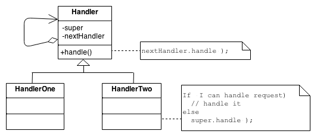

# Chain Of Responsibility Pattern
Behavioral Design Pattern in C#


## General Diagram


## The code sample using this pattern

Here the code sample using this pattern, that you can find in *Program.cs*:

```cs
// Setup Chain of Responsibility
Handler redHandler = new RedHandler();
Handler greenHandler = new GreenHandler();
Handler blueHandler = new BlueHandler();

redHandler.SetNextHandler(greenHandler);
greenHandler.SetNextHandler(blueHandler);


// Requests

Request request = null;

request = new Request("001", "Red");
redHandler.ProcessRequest(request);

request = new Request("002", "Green");
redHandler.ProcessRequest(request);

request = new Request("003", "Blue");
redHandler.ProcessRequest(request);

request = new Request("999", "White");
redHandler.ProcessRequest(request);
```

And the results:

```cs
RedHandler approved request 001 as Red
GreenHandler approved request 002 as Green
BlueHandler approved request 003 as Blue
BlueHandler denied 999 as White
```

## Post about this pattern

The post (in Spanish) about the comments and explanation of this pattern with the code sample of this repository, (can be found here)[https://geeks.ms/jorge/2020/08/18/chain-of-responsibility-pattern/].
